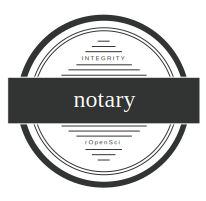

```{r include=FALSE}
knitr::opts_chunk$set(collapse = TRUE)
options(width = 120)
```

[](http://www.repostatus.org/#concept)
[](https://travis-ci.org/ropenscilabs/notary)



`notary` : Signing and Verification of R Packages

### Methods

- `download_packages`:	Download and verify packages
- `install_release`:	Validate that the current GitHub release is GPG signed and install it if so
- `validate_release`:	Validate that the current GitHub release is GPG signed
- `retrieve_release_signature`:	Retrieve the GitHub signing information for the latest release of a package
- `get_tags`:	Retrieve a data frame of GitHub package tag (release) info

### Usage

```{r message=FALSE}
library(notary)
library(tidyverse)
```

```{r}
validate_release("hrbrmstr/hrbrthemes")

validate_release("ironholds/rgeolocate")

retrieve_release_signature("hrbrmstr/ggalt")

glimpse(get_tags("hrbrmstr/hrbrthemes"))

get_tags("tidyverse/dplyr")
```

```{r echo=FALSE, eval=FALSE}
install_release("hrbrmstr/hrbrthemes")

# fails
install_release("ironholds/rgeolocate")
```

### Code of Coduct

Please note that this project is released with a [Contributor Code of Conduct](CONDUCT.md). By participating in this project you agree to abide by its terms.
