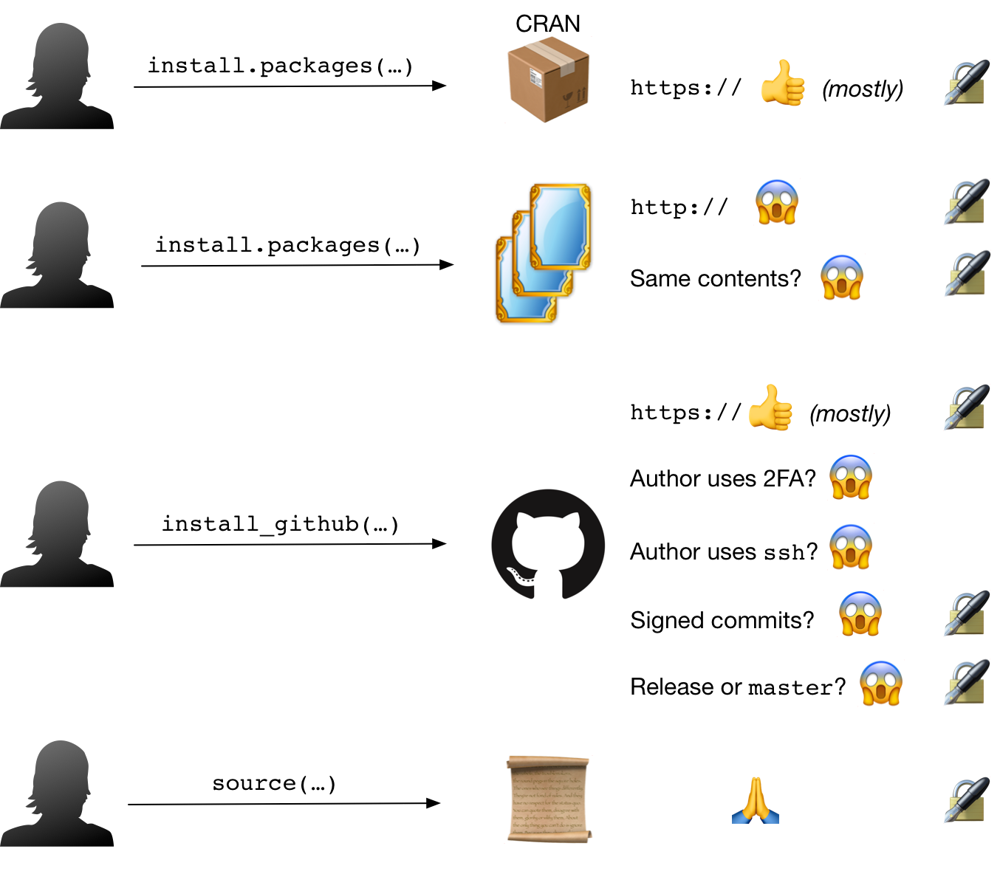

```{r include=FALSE}
knitr::opts_chunk$set(collapse = TRUE)
options(width = 120)
```


### Problems



### Solutions (current)

**GitHub**

- Only install signed releases
- Verify release signatures

**CRAN**

- Reimagining integrity mirror integrity

<hr noshade size="0.5"/>

 &nbsp;

[](http://www.repostatus.org/#wip) 
[](https://travis-ci.org/ropenscilabs/notary)
[](https://ci.appveyor.com/project/jeroen/notary)

`notary` : Signing and Verification of R Packages

### Methods

More for users:

CRAN-ish

- `install_packages`: Install and verify packages
- `download_packages`:	Download and verify packages
- `available_packages`: Download and verify package indices

GitHub-ish

- `install_release`:	Validate that the current GitHub release is GPG signed and install it if so
- `validate_release`:	Validate that the current GitHub release is GPG signed
- `retrieve_release_signature`:	Retrieve the GitHub signing information for the latest release of a package
- `get_tags`:	Retrieve a data frame of GitHub package tag (release) info

`source()`-ish

- `source_safe_sign`:	Source a file with verification
- `sys_source_safe_sign`:	Source a file with verification

More for plumbers:

- `package_index_prepare`:	Prepare a package index

### The Book of R [Security]

<https://ropenscilabs.github.io/r-security-practices/index.html>

### A gif is worth a thousand words


### Usage

```{r message=FALSE}
library(notary)
library(tidyverse)
```

```{r}
validate_release("hrbrmstr/hrbrthemes")

validate_release("ironholds/rgeolocate")

retrieve_release_signature("hrbrmstr/ggalt")

glimpse(get_tags("hrbrmstr/hrbrthemes"))

get_tags("tidyverse/dplyr")
```

```{r echo=FALSE, eval=FALSE}
install_release("hrbrmstr/hrbrthemes")

# fails
install_release("ironholds/rgeolocate")
```

### Code of Coduct

Please note that this project is released with a [Contributor Code of Conduct](CONDUCT.md). By participating in this project you agree to abide by its terms.
